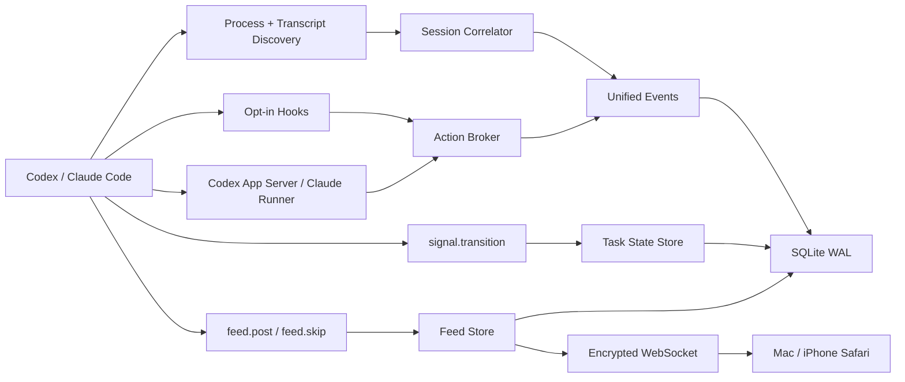

# Zimlo MVP 架构

## 包边界

| 目录 | 职责 |
|---|---|
| `packages/protocol` | Zod 协议、事件/帖子/任务状态/能力模型、设备配对与帧加密 |
| `packages/adapters` | 进程识别、transcript 扫描与容错 parser、脱敏、测试命令识别 |
| `apps/cli` | Fastify Bridge、SQLite、发现器、Agent MCP tools、Action Broker、hooks、app-server/resume、CLI |
| `apps/web` | React/Vite Feed、Tasks、详情、Diff、回复、审批与设备管理 |

## 数据流

## 发现与关联

Bridge 启动时先读取进程快照，再扫描 transcript。活跃进程能关联到的 session 不受 transcript 数量上限影响；其余每个 provider 最多载入最近 200 个。文件 offset、size 与 mtime 存入 SQLite，后续只解析追加字节；截断或轮转时从头恢复，不重复写入稳定事件 id。

关联顺序是 provider session id、绝对 transcript 路径、PID 与启动时间、TTY/打开文件/父进程。cwd 与更新时间只参与弱证据评分。证据冲突时保留独立 session 并设置 `correlationUncertain`，同时关闭不安全的回复能力。

## 交互租约

- `activePid !== null`：外部终端占用，`replyable=false`，不做 TTY 注入。
- 空闲 Codex：先用 app-server `thread/read` 再次确认不是 active，之后 `thread/resume` + `turn/start`。
- 空闲 Claude：使用 `claude -p --resume ... --output-format stream-json`。
- 同一 Zimlo session 同时只能持有一个受控 turn lease。
- hook 或 app-server 的每个上游请求都创建独立 resolver；决策必须匹配 action、session、device 与 idempotency key。

## 审批与故障恢复

Action Broker 的 pending resolver 只存在内存中，SQLite 仅用于展示与审计。Bridge 启动时会把旧 pending/submitted action 全部标记 expired，因此旧手机操作不可能补发到新进程。同步 hook 最多等待 8 分钟；Bridge 不可用或超时则返回无决定，让外部 agent 恢复原生流程。受控 app-server turn 超时则安全取消当前请求。

Session、persistent 与高风险决策要求确认短语。永久规则只有在 provider 明确给出精确 amendment 时才显示，Zimlo 不生成宽泛 allow 规则。

## Diff 归属

`turn/diff/updated`、hook 工具事件或 provider 精确 item 可归属到 session。普通工作区 `git diff` 不会被伪装为 session Diff；多个 session 共用 cwd 时尤其如此。

## LAN 通道

`zimlo start` 只绑定 `127.0.0.1`；`--lan` 仅选择 loopback、RFC1918 或 ULA 地址。二维码携带 2 分钟单次 secret，X25519 协商设备密钥，随后每个方向派生独立 XChaCha20-Poly1305 密钥并使用连接级计数器防重放。浏览器密钥保存在 IndexedDB，Mac 可立即撤销设备。
