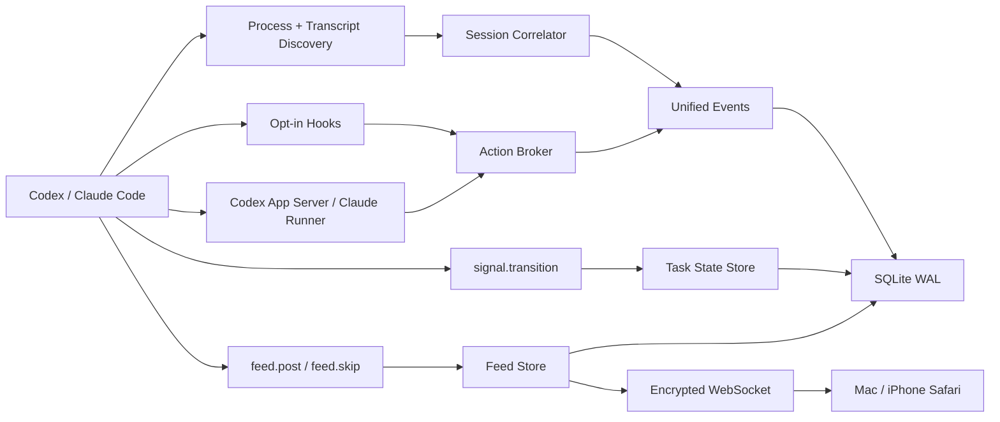

# Zimlo MVP 架构

## Codex GUI 集成

Codex GUI 不提供 CLI 的 `/hooks` 浏览器，因此 Zimlo 不再把用户级 `~/.codex/hooks.json` 当作 GUI 安装入口。`@zimlo/cli` 内置一个可物化的 Personal 插件模板：

```text
Zimlo Codex plugin
├── .codex-plugin/plugin.json
├── .mcp.json                  # 安装时写入绝对 Node/CLI 路径
├── skills/zimlo-feed/SKILL.md
└── hooks/hooks.json           # 安装时写入绝对 hook 命令
```

本机 Settings 通过加密 WebSocket 请求 Bridge 安装插件源；Bridge 只接受 local-admin 设备。安装器保留现有 `~/.agents/plugins/marketplace.json` 内容，幂等更新指向 `~/plugins/zimlo` 的 `./plugins/zimlo` 条目，并用临时目录、rename 和备份更新文件。用户随后在 Codex GUI 的 Plugins → Personal 中完成插件安装和 hook 审核，新任务才加载 Skill、MCP 与 hooks。

Codex GUI 插件只安装 `SessionStart`、`UserPromptSubmit`、`PermissionRequest` 和 `Stop`，避免为普通 tool call 增加 hook 开销。MCP 进程会先探测 Unix Socket；Bridge 不存在时以 detached 本地进程自动启动，并在 4 秒内等待就绪。非审批 hook 2.5 秒内 fail-open，Stop 只静默落下 `implicit_skip`，永不阻断 Agent 的结束循环。

用户级 hooks 仍服务 Codex CLI 与 Claude Code，不再作为 Codex GUI 的推荐路径。`UserPromptSubmit` 只写入 `user_instruction` 事件供 Task 详情追溯，不再生成 Feed 帖子；Feed 帖子必须由 Agent 使用 V2 结构化字段主动编辑。

## 包边界

| 目录 | 职责 |
|---|---|
| `packages/protocol` | Zod 协议、事件/帖子/任务状态/能力模型、设备配对与帧加密、客户端共享策略函数与测试向量 |
| `packages/adapters` | 进程识别、transcript 扫描与容错 parser、脱敏、测试命令识别 |
| `apps/cli` | Fastify Bridge、SQLite、发现器、Agent MCP tools、Action Broker、hooks、app-server/resume、CLI |
| `apps/web` | React/Vite Feed、Tasks、Agents、Task Detail、回复、审批与 Settings |

## 数据流



## 发现与关联

Bridge 启动时先读取进程快照，再扫描 transcript。活跃进程能关联到的 session 不受 transcript 数量上限影响；其余每个 provider 最多载入最近 200 个。文件 offset、size 与 mtime 存入 SQLite，后续只解析追加字节；截断或轮转时从头恢复，不重复写入稳定事件 id。

关联顺序是 provider session id、绝对 transcript 路径、PID 与启动时间、TTY/打开文件/父进程。cwd 与更新时间只参与弱证据评分。证据冲突时保留独立 session 并设置 `correlationUncertain`，同时关闭不安全的回复能力。

`provider` 与 `surface` 是两个维度：provider 为 Codex/Claude，surface 为 GUI/CLI/managed/unknown。Codex GUI 插件与 Codex CLI hooks 写入明确 surface；Claude 的共享用户级 hook 根据 TTY 和 Claude Desktop 父进程链识别 GUI/CLI，证据不足时保留 unknown；app-server 与 controlled runner 写入 managed。未知来源不能覆盖已经确认的 surface，同一个 provider session 切换界面后仍属于同一 Task Detail。

## Project、Session 与卡片

Project 是 SQLite 中的一等持久实体，不再在每次 Snapshot 时临时从 cwd 生成。Project Agent 是它的用户可编辑展示身份，Codex/Claude 只作为 Runtime。当前关系为：

```text
Project
├── project_locations
├── AgentProfile
│   ├── displayName / avatar / bio
│   └── defaultProvider
├── Sessions / Tasks
│   └── events + actions + task_commands
└── feed_posts
    └── 同时保留 session_id（可归属时）
```

新 Project 使用持久 UUID。Session 写入时先把 cwd 归一到最近 Git root，再使用 origin remote 指纹、无 remote 时的 Git root commit 和 `project_locations` 找回已有 Project；因此常见的项目移动或改名不会丢失 Agent Profile。非 Git 目录回退到规范路径身份，`/`、用户主目录等宽泛根目录不会创建 Project。旧 Project ID 保持不变并在启动时幂等补充身份指纹。

插件卡片优先使用 provider session id、已绑定 checkpoint 或唯一开放 hook checkpoint 找到强 Session，再从 Session 继承 `project_id`。无法确定时保留为未归属卡片，绝不根据 MCP 辅助进程的 cwd 猜项目。Task Detail 按 `session_id` 聚合；Agent Profile 按 `project_id` 汇总跨任务 Timeline，数据只保存一份。

Tasks 的项目目录按名称稳定排序；任务只在 attention/active/recent 状态改变时跨组，组内使用不可变 `created_at` 与 id 排序。心跳、transcript 追加和普通 `last_activity_at` 更新只刷新文案，不改变列表位置。

## 交互租约

- `activePid !== null`：外部终端占用，`replyable=false`，不做 TTY 注入。
- 空闲 Codex：先用 app-server `thread/read` 再次确认不是 active，之后 `thread/resume` + `turn/start`。
- 空闲 Claude：使用 `claude -p --resume ... --output-format stream-json`。
- 同一 Zimlo session 同时只能持有一个受控 turn lease。
- hook 或 app-server 的每个上游请求都创建独立 resolver；决策必须匹配 action、session、device 与 idempotency key。

## 审批与故障恢复

Action Broker 的 pending resolver 只存在内存中，SQLite 仅用于展示与审计。Bridge 启动时会把旧 pending/submitted action 全部标记 expired，因此旧手机操作不可能补发到新进程。同步 hook 最多等待 8 分钟；Bridge 不可用或超时则返回无决定，让外部 agent 恢复原生流程。受控 app-server turn 超时则安全取消当前请求。

Session、persistent 与高风险决策要求确认短语。永久规则只有在 provider 明确给出精确 amendment 时才显示，Zimlo 不生成宽泛 allow 规则。

## Diff 归属

`turn/diff/updated`、hook 工具事件或 provider 精确 item 可归属到 session。普通工作区 `git diff` 不会被伪装为 session Diff；多个 session 共用 cwd 时尤其如此。

## LAN 通道

`zimlo start` 只绑定 `127.0.0.1`；`--lan` 仅选择 loopback、RFC1918 或 ULA 地址。二维码携带 2 分钟单次 secret，X25519 协商设备密钥，随后每个方向派生独立 XChaCha20-Poly1305 密钥并使用连接级计数器防重放。浏览器密钥保存在 IndexedDB，Mac 可立即撤销设备，并按设备持久授权手机审批。

## Cloudflare 远程通道

Cloudflare Worker 负责鉴权和路由，D1 只保存 Mac 安装公钥、设备访问令牌哈希、APNs token 与投递审计；每个 Mac 安装映射到一个使用 WebSocket Hibernation API 的 Durable Object。Mac 主动建立出站 WebSocket，手机在 LAN 失败后连接同一对象。Durable Object 只看到连接 ID 与 Bridge 密文，不能读取 Snapshot、任务正文、审批内容或命令。

远程通道不另造应用协议：Mac relay 把每个手机连接映射到本机 loopback `/ws`，因此仍由 `SecureSocket` 验证设备密钥、权限、单调计数器和端到端加密。手机缓存最近 Snapshot；Mac 不在线时写操作留在持久 outbox，不会写入 D1，重连后使用既有 idempotency key 重放。

Mac 安装身份使用 P-256 签名，私钥只保存在权限为 `0600` 的本机 SQLite metadata；每台手机的随机云访问令牌只在可信配对时下发，Cloudflare 只保存 SHA-256 哈希。撤销设备会同时撤销本地 Bridge 身份和云端记录。

## 客户端共享策略

Feed 合并与优先级、outbox 语义键、重连退避、可撤回状态与快捷审批资格曾由 Web（TypeScript）与 iOS（Swift）各自手写并已开始漂移。现在规则集中在两处逐行对齐的实现：

- `packages/protocol/src/policy.ts`：TS 纯函数，apps/web 直接引用；
- `apps/ios/Zimlo/SharedRules.swift`：不依赖 SwiftUI 的纯逻辑层。

`packages/protocol/test-vectors/` 下的版本化 JSON 向量（feed-merge / feed-priority / outbox-keys / backoff / quick-approve / cancelable-states，共 85 个 case）同时驱动 packages/protocol 的 vitest 与 iOS 的 VectorTests（XCTest）。任何语义改动必须先改向量，再同步两侧实现。

Feed 展示在策略之上再加一层“页面会话固定序列”（apps/web `feedSequence.ts`，iOS `FeedView` 的 currentOrder）：首次载入按协议优先级建序后，已有卡不因已读、审批完成或快照刷新换位；新卡与重新可操作的卡只追加到 caught-up 之前；已处理卡在当前会话原位显示完成状态。

## 协议增量

- `task.command.cancel`：撤回排队指令。`commandId` 与设备作用域 `idempotencyKey` 必须恰选其一定位；仅 queued 状态可撤回，dispatching/running/终态返回 `command_not_cancelable`；重复撤回幂等返回当前状态。
- `feed.dismiss.set { itemId, dismissed, idempotencyKey }`：按设备设置/取消 Feed 移除状态，按 `(deviceId, idempotencyKey)` 去重，重放只回报当前状态。旧 `feed.dismiss`（单向移除）保留兼容。`dismissed=false`（撤销）没有专用增量回执——发起方依赖随后的设备作用域快照调和，这是已知的不对称。
- `task.pin` / `task.archive` 接受可选 `idempotencyKey`，与归档/取消归档的 6 秒撤销配套。

## 本机服务管理

`~/.zimlo/run/` 下的服务状态文件：

- `service.json`：运行中 Bridge 写入的服务描述符（`pid` / `port` / `version` / `protocolVersion` / `startedAt` / `socketPath` / `logPath`），`zimlo status`、`zimlo open` 与 macOS 的服务复用判定都读它；进程退出时只清除自己写入的描述符。
- `service.lock/`：实例锁目录，`owner.json` 记录 pid/token/entrypoint/startedAt，崩溃遗留的锁由下一进程安全回收。
- `startup-diagnostics.json`：最近一次启动结果（成功，或 `port_in_use` / `config_corrupt` / `runtime_missing` / `startup_failed` 加消息），由 `zimlo status` 与 `zimlo doctor` 展示。
- `manual-stop`：`zimlo stop` 写入的手动停止标记。契约：只有 macOS App 的自动管理（启动拉起、崩溃自动重启、监控循环）尊重它；`zimlo start` 启动时清除（输入 start 本身就是手动动作）；`zimlo mcp` 自动拉起 Bridge 时忽略。

`zimlo stop` 校验描述文件的 PID 归属后发送 SIGTERM，拒绝停止无法确认归属的进程。macOS 复用 4747 端口上已有服务前会先探测 /healthz 并要求 `protocolVersion == 2`；崩溃自动重启按 1/2/4/8/16/30 秒退避，两分钟滑动窗口内失败五次熔断，等待用户在菜单栏手动重试；EADDRINUSE、配置损坏与运行时缺失是终止型故障，不自动重启，端口占用尽力显示进程名与 PID。

## 本地 API 与集成探测

所有本机 API 路由返回稳定错误结构 `{ code, message, recoverable, action? }`：macOS 按此解码展示（并兼容旧 Fastify 默认错误结构），`action` 是用户下一步可执行的操作。集成状态探测（`codex mcp get`、`codex plugin list` 等子进程）使用 10 秒 TTL 缓存加单飞请求合并，hooks/MCP/插件安装类变更后主动失效，菜单栏每秒轮询不会重复拉起子进程。

## 推送路由与隐私边界

低风险审批（无确认短语的 once 允许 + 无确认短语的 deny）支持锁屏快捷操作。决策细节只放在应用层加密的密封路由 `PushRouteV1`（`version` / `sessionId` / `actionId` / `decision` / `denyDecision` / `expiresAt` / `category`）内；APNs `aps.category` 是明文通用标识 `ZIMLO_LOW_RISK_APPROVAL`——系统需要明文 category 才能渲染锁屏按钮，但它不含任何任务内容，任务标题与决策 id 永不离开加密路由。apps/cloud Worker 把 category 透传到 APNs（截断到 64 字符）。不满足快捷条件的审批不携带 category，只能打开 App 处理；旧客户端收到未知 category 按普通打开处理，快捷路由解析失败同样回退普通打开。
