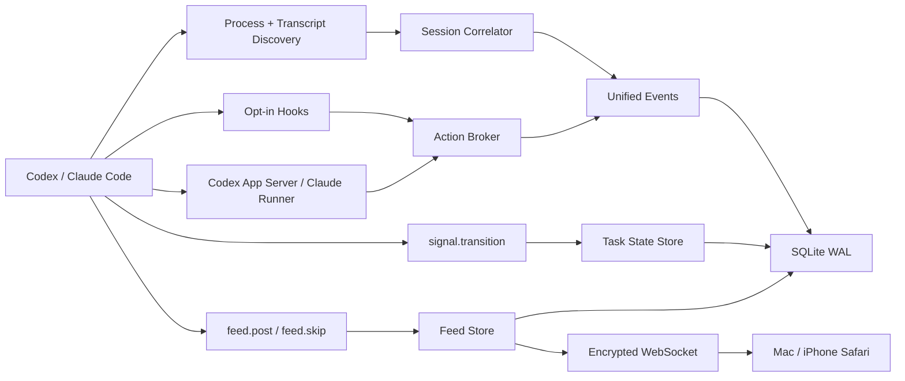

# Zimlo MVP 架构

## Codex GUI 集成

Codex GUI 不提供 CLI 的 `/hooks` 浏览器，因此 Zimlo 不再把用户级 `~/.codex/hooks.json` 当作 GUI 安装入口。`@zimlo/cli` 内置一个可物化的 Personal 插件模板：

```text
Zimlo Codex plugin
├── .codex-plugin/plugin.json
├── .mcp.json                  # 安装时写入绝对 Node/CLI 路径
├── skills/zimlo-feed/SKILL.md
└── hooks/hooks.json           # 安装时写入绝对 hook 命令
```

本机 Profile 通过加密 WebSocket 请求 Bridge 安装插件源；Bridge 只接受 local-admin 设备。安装器保留现有 `~/.agents/plugins/marketplace.json` 内容，幂等更新指向 `~/plugins/zimlo` 的 `./plugins/zimlo` 条目，并用临时目录、rename 和备份更新文件。用户随后在 Codex GUI 的 Plugins → Personal 中完成插件安装和 hook 审核，新任务才加载 Skill、MCP 与 hooks。

Codex GUI 插件只安装 `SessionStart`、`UserPromptSubmit`、`PermissionRequest` 和 `Stop`，避免为普通 tool call 增加 hook 开销。MCP 进程会先探测 Unix Socket；Bridge 不存在时以 detached 本地进程自动启动，并在 4 秒内等待就绪。非审批 hook 2.5 秒内 fail-open，Stop 只静默落下 `implicit_skip`，永不阻断 Agent 的结束循环。

用户级 hooks 仍服务 Codex CLI 与 Claude Code，不再作为 Codex GUI 的推荐路径。`UserPromptSubmit` 只写入 `user_instruction` 事件供 Task 详情追溯，不再生成 Feed 帖子；Feed 帖子必须由 Agent 使用 V2 结构化字段主动编辑。

## 包边界

| 目录 | 职责 |
|---|---|
| `packages/protocol` | Zod 协议、事件/帖子/任务状态/能力模型、设备配对与帧加密 |
| `packages/adapters` | 进程识别、transcript 扫描与容错 parser、脱敏、测试命令识别 |
| `apps/cli` | Fastify Bridge、SQLite、发现器、Agent MCP tools、Action Broker、hooks、app-server/resume、CLI |
| `apps/web` | React/Vite Feed、Tasks、详情、Diff、回复、审批与设备管理 |

## 数据流



## 发现与关联

Bridge 启动时先读取进程快照，再扫描 transcript。活跃进程能关联到的 session 不受 transcript 数量上限影响；其余每个 provider 最多载入最近 200 个。文件 offset、size 与 mtime 存入 SQLite，后续只解析追加字节；截断或轮转时从头恢复，不重复写入稳定事件 id。

关联顺序是 provider session id、绝对 transcript 路径、PID 与启动时间、TTY/打开文件/父进程。cwd 与更新时间只参与弱证据评分。证据冲突时保留独立 session 并设置 `correlationUncertain`，同时关闭不安全的回复能力。

`provider` 与 `surface` 是两个维度：provider 为 Codex/Claude，surface 为 GUI/CLI/managed/unknown。Codex GUI 插件与 Codex CLI hooks 写入明确 surface；Claude 的共享用户级 hook 根据 TTY 和 Claude Desktop 父进程链识别 GUI/CLI，证据不足时保留 unknown；app-server 与 controlled runner 写入 managed。未知来源不能覆盖已经确认的 surface，同一个 provider session 切换界面后仍属于同一 Task Profile。

## Project、Session 与卡片

Project 是 SQLite 中的一等持久实体，不再在每次 Snapshot 时临时从 cwd 生成。当前关系为：

```text
Project
├── project_locations
├── Sessions / Tasks
│   └── events + actions + task_commands
└── feed_posts
    └── 同时保留 session_id（可归属时）
```

Session 写入时先把 cwd 归一到最近 Git root，再获得稳定的路径哈希 `project_id`；非 Git 目录保留其规范绝对路径，`/`、用户主目录等宽泛根目录不会创建 Project。现有数据库启动时会幂等回填 Session、FeedPost 和未执行 TaskCommand 的项目关系。

插件卡片优先使用 provider session id、已绑定 checkpoint 或唯一开放 hook checkpoint 找到强 Session，再从 Session 继承 `project_id`。无法确定时保留为未归属卡片，绝不根据 MCP 辅助进程的 cwd 猜项目。Profile Timeline 仍按 `session_id` 聚合，Project 目录则按 `project_id` 汇总任务与卡片，数据只保存一份。

Tasks 的项目目录按名称稳定排序；任务只在 attention/active/recent 状态改变时跨组，组内使用不可变 `created_at` 与 id 排序。心跳、transcript 追加和普通 `last_activity_at` 更新只刷新文案，不改变列表位置。

## 交互租约

- `activePid !== null`：外部终端占用，`replyable=false`，不做 TTY 注入。
- 空闲 Codex：先用 app-server `thread/read` 再次确认不是 active，之后 `thread/resume` + `turn/start`。
- 空闲 Claude：使用 `claude -p --resume ... --output-format stream-json`。
- 同一 Zimlo session 同时只能持有一个受控 turn lease。
- hook 或 app-server 的每个上游请求都创建独立 resolver；决策必须匹配 action、session、device 与 idempotency key。

## 审批与故障恢复

Action Broker 的 pending resolver 只存在内存中，SQLite 仅用于展示与审计。Bridge 启动时会把旧 pending/submitted action 全部标记 expired，因此旧手机操作不可能补发到新进程。同步 hook 最多等待 8 分钟；Bridge 不可用或超时则返回无决定，让外部 agent 恢复原生流程。受控 app-server turn 超时则安全取消当前请求。

Session、persistent 与高风险决策要求确认短语。永久规则只有在 provider 明确给出精确 amendment 时才显示，Zimlo 不生成宽泛 allow 规则。

## Diff 归属

`turn/diff/updated`、hook 工具事件或 provider 精确 item 可归属到 session。普通工作区 `git diff` 不会被伪装为 session Diff；多个 session 共用 cwd 时尤其如此。

## LAN 通道

`zimlo start` 只绑定 `127.0.0.1`；`--lan` 仅选择 loopback、RFC1918 或 ULA 地址。二维码携带 2 分钟单次 secret，X25519 协商设备密钥，随后每个方向派生独立 XChaCha20-Poly1305 密钥并使用连接级计数器防重放。浏览器密钥保存在 IndexedDB，Mac 可立即撤销设备，并按设备持久授权手机审批。
